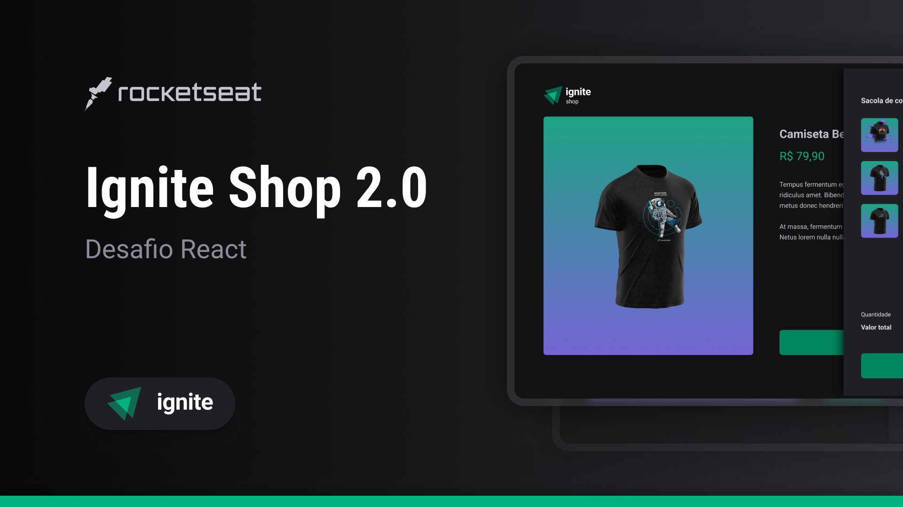

# IgniteShop

## Origin

- Project created together with @Rocketseat 🚀

- Ignite trail | ReactJS ⚛️

## Features
- 👕 T-shirt buying website


- 🖱️ Select one or more t-shirts for the backpack


- 👀 You can see the t-shirt details by clicking on the t-shirt


- 🛍️ By clicking on the backpack you can see the selected t-shirts and finalize your purchase


- 💳 You will be redirect to the Stripe checkout. Enter your details to confirm the purchase


- ✅ When confirming the purchase you will be redirected to the success page


## Technologies used
 - HTML
 - CSS
 - Typescript
 - React.js
 - Next.js

## Libraries used
 - axios
 - eslint
 - keen-slider
 - next
 - phosphor-react
 - react-dom
 - stitches
 - stripe

## How to run this project
```bash
# Clone this repository
$ git clone https://github.com/Gian-Milani/IgniteShop.git

# Access the folder
$ cd IgniteShop

# Install dependencies
$ npm install 

# Run the aplication
$ npm run dev
```

## Resume
This project was based on a challenge from @Rocketseat's Ignite Journey, ReactJS trail. Practicing the use of HTTP clients, using the SSR, SSG, SPA rendering strategies, consuming the stripe API for product and sales management of an online t-shirt store.

#

